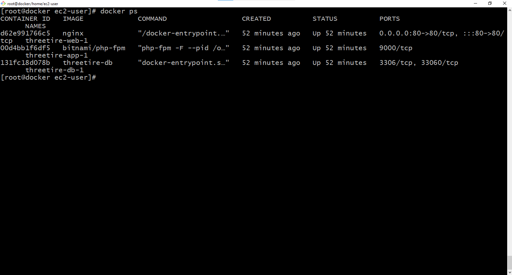
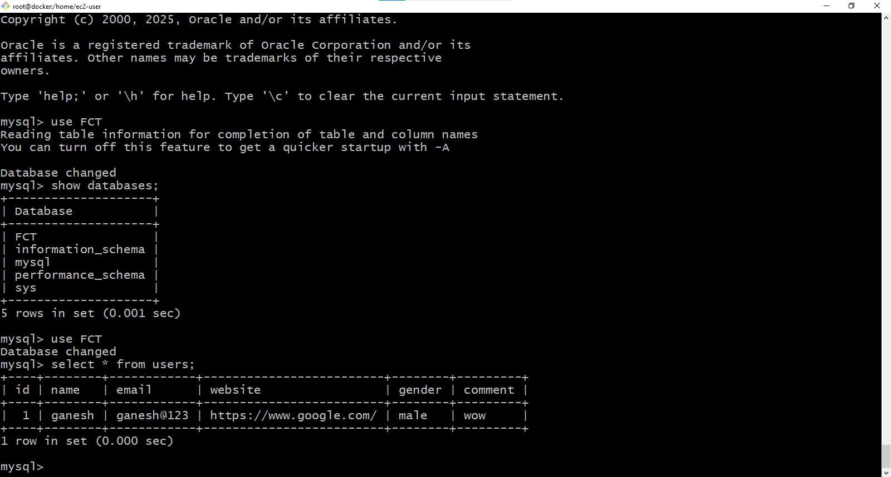
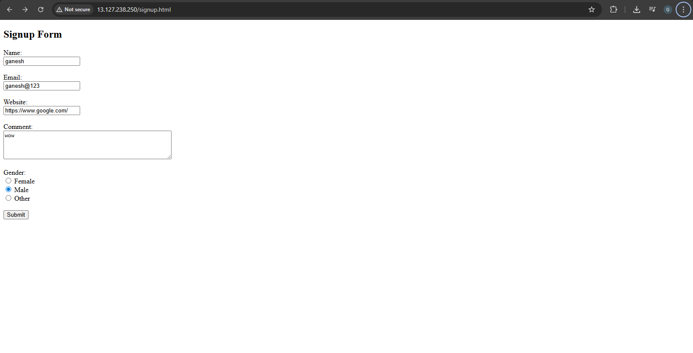
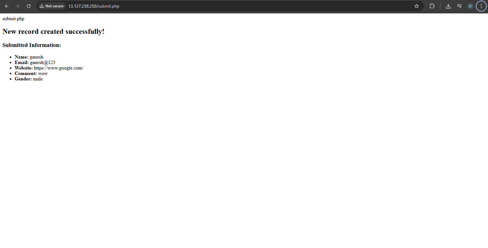

# Three-Tier Architecture using Docker (Web + App + Database)

This project demonstrates a **Three-Tier Architecture** implemented using **Docker and Docker Compose**.  
The application consists of a **web layer (Nginx)**, **application layer (PHP)**, and **database layer (MySQL)**, each running in a separate container.

---

## Architecture Overview


  


### Tier Responsibilities

### Web Tier
- Built using **Nginx**
- Serves the HTML signup form
- Forwards requests to the application layer

### Application Tier
- Built using **PHP (PHP-FPM)**
- Processes form submission
- Connects to the MySQL database

### Database Tier
- Built using **MySQL**
- Stores user signup data
- Uses Docker volumes for persistence

---

## Project Structure
```
hreetire/
│
├── app/
│ └── code/
│ └── submit.php
│
├── db/
│ ├── Dockerfile
│ └── init.sql
│
├── web/
│ ├── code/
│ │ └── signup.html
│ └── config/
│ └── default.conf
│
└── docker-compose.yml
```

---

## Technologies Used

- Docker
- Docker Compose
- Nginx
- PHP (PHP-FPM)
- MySQL
- HTML

---

## Application Flow

1. User opens the signup page in the browser  
2. Nginx serves `signup.html`  
3. Form data is sent to `submit.php`  
4. PHP processes the request  
5. Data is inserted into MySQL  
6. Confirmation message is displayed to the user  

---

## File Explanation

### signup.html (Web Tier)
- Displays a signup form
- Collects name, email, website, comment, and gender
- Sends data to the application layer using POST method

---

### submit.php (Application Tier)
- Receives form data using `$_POST`
- Connects to MySQL using service name `db`
- Inserts data into the `users` table
- Displays submitted information after success

---

### Database Dockerfile

```dockerfile
FROM mysql
ENV MYSQL_ROOT_PASSWORD=root
ENV MYSQL_DATABASE=FCT
COPY init.sql /docker-entrypoint-initdb.d/
```
- Builds a custom MySQL image

- Initializes database automatically

### init.sql
```
USE FCT;

CREATE TABLE users (
    id INT PRIMARY KEY AUTO_INCREMENT,
    name VARCHAR(20),
    email VARCHAR(100),
    website VARCHAR(255),
    gender VARCHAR(6),
    comment VARCHAR(100)
);
```
# Docker Compose Configuration

## Services

- **web**: Nginx web server  
- **app**: PHP-FPM application container  
- **db**: MySQL database container  

## Networks

- **webnet**: Communication between web and app  
- **dbnet**: Secure communication between app and database  

## Volumes

- **vol1**: Persistent MySQL storage  

## How to Run the Project

### Prerequisites

- Docker installed  
- Docker Compose installed  
- Git installed  

### Steps
```
git clone https://github.com/your-username/threetire.git
cd threetire
docker-compose up -d
```

### Access the Application
**Open your browser and visit:**
```
http://localhost
```
## Screenshots
## Screenshots

| Screenshot Name | Image |
|-----------------|-------|
| All Containers Running |  |
| Database Data Saved |  |
| Web Application Home Page |  |
| After Form Submission |  |


## Key Concepts Demonstrated

- Three-tier architecture  
- Docker containerization  
- Docker networking  
- Persistent storage using volumes  
- PHP–MySQL integration  
- Nginx web server  
- DevOps best practices  

## Use Cases

- DevOps practice project  
- Docker hands-on learning  
- Resume and GitHub portfolio project  
- Interview demonstration  

## Author

### *Ganesh Jadhav*   
*DevOps & Cloud Enthusiast*  
**E-mail:** jadhavg9370@gmail.com   
**Linkedin:** https://www.linkedin.com/in/ganesh-jadhav-30813a267/

